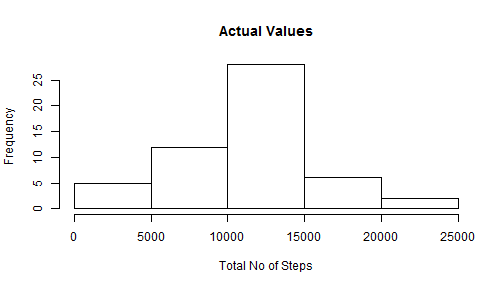
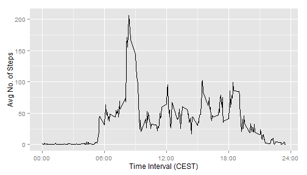
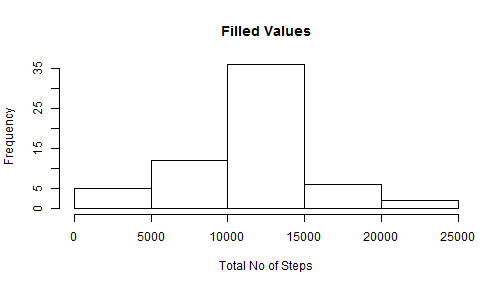
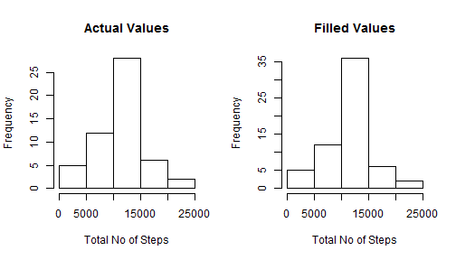
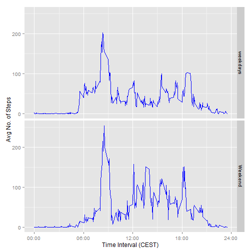

##Introduction:

According to the requirement of assignment the document describes the detail
analyses with code in the following manner :-

* Loading and preprocessing of data
* Total number of steps taken per day
* Average daily activity pattern
* Handling with missing values
* And finally comparsion between the weekdays and weekend steps

Before diving to the assignment detail, let first consier the packages which are
loaded for onward calculation.


```r
library(lubridate)
library(dplyr)
library(ggplot2)
library(xtable)
```


###*1. Loading and Processing Data:*

In this step the data is loaded from the HDD in csv format and the Factor is
converted to simple vectors. The **date** variable in the data is converted to
*date type* using *lubridate package*.


```r
setwd("E:/Hamza/Coursera/Reproducable Research/Assignment 1")

movData <- read.csv("activity.csv", sep = ",", stringsAsFactors = FALSE)
movData$date <- ymd(movData$date)
```


###*2. Total Number of Steps/day:*

The total number of steps is calculted by using *aggregate* function for
each day that is stored in **stepsDays** and then their histogram is plotted that
shows the distrubtion of data over x-axis.


```r
stepsDays <- aggregate(steps~date, data = movData, FUN = sum)
hist(stepsDays$steps, main = "Actual Values", xlab = "Total No of Steps")
```

 

```r
#mean and meadian of total number of steps
meanStep <- mean(stepsDays$steps)
medainStep <- median(stepsDays$steps)
```

The mean and median of steps taken per day is found to be **1.0766189 &times; 10<sup>4</sup>** and
**10765** respectively.


###*3. Average Daily Activity Patern:*

For this problem the 5 minute interval is taken on x-axis; where for each interval
the mean of all days form October to November is calculted and is plotted on y-axis
against interval value constructing a time series plot.


```r
avgStep <- aggregate(steps~interval, data = movData, FUN = mean)

g <- ggplot(data = avgStep, aes(interval,steps))
g + geom_line(type = "l") + xlab("Time Interval (CEST)") + ylab("Avg No. of Steps") +
       scale_x_continuous(breaks=c(0,600,1200,1800,2400),
                          labels = c("00:00", "06:00", "12:00", "18:00", "24:00"))
```

 

```r
(filter(avgStep, avgStep$steps == max(avgStep$steps)))
```

```
##   interval    steps
## 1      835 206.1698
```
It can be seen in the result that at interval equal to **835**  the steps has maximum value **206.16**


###*4. Handling Missing Values:*
The missing values are observed mostly by the early morning time i.e aroun 24:00 to 5:00.
there are two strategies which are considered to fill the missing values with.
       
* Replace the missing value by the average value of that day
       * This may result in error as the average value of day may be too large for the
       missing values which are present in morning time(described above)
* Replace the missing value with averaging the interval values across all the values
       * This treatment is considered for the above problem mentioned before; which results
       in replacing value having about same weightage over time.


```r
lmv <- length(movData$steps[is.na(movData$steps)])

# The strategy is carried out by calculating the mean of all values for each interval using
# aggregate function, and then only null values are extracted from the original data.
valRep <- aggregate(steps~interval, data = movData, FUN = mean)
naV <- movData[is.na(movData$steps),]
fillData <- movData

# The value of null interval is mapped with each average value of interval calculted above 
# to the newly created dataset.
for(i in naV$interval){
       fillData$steps[fillData$interval==i & is.na(fillData$steps)] <-
              valRep$steps[valRep$interval==i]
}
```
The total number of missing values in the data set is found to be **2304**.
Again, the total number of steps taken each day with filled value dataset is calculted.
and their histogram is plotted.

```r
stepsDays2 <- aggregate(steps~date, data = fillData, FUN = sum)

hist(stepsDays2$steps, main = "Filled Values", xlab = "Total No of Steps")
```

 

```r
meanStep2 <- mean(stepsDays2$steps)
medainStep2 <- median(stepsDays2$steps)
```
For comparison the actual and filled data set total steps are drawn on histogram and 
comparision result values are shown in table

```r
namedVal <- rbind(c(meanStep, meanStep2),c(medainStep,medainStep2))
colnames(namedVal)<- c("Actual Val", "Filled Val")
rownames(namedVal) <- c("mean", "median")                 
namedVal
```

```
##        Actual Val Filled Val
## mean     10766.19   10766.19
## median   10765.00   10766.19
```

```r
par(mfrow= c(1,2))
hist(stepsDays$steps, main = "Actual Values", xlab = "Total No of Steps")
hist(stepsDays2$steps, main = "Filled Values", xlab = "Total No of Steps")
```

 

It can be interpurated from the results that median is slightly changed. whereas 
mean remained same. Whereas, looking at the histogram it can clearly be seen that
there is dramastic change in frequency values.


###*5. Comparisoin b/w Weekdays and Weekend:*


The treated data (removed missing values) is factored into two values *weekdays*
and *weekend* and then each of two levles the average values of steps are 
calculted and plotted accordingly.

```r
# the weekday value are factored in two level from 0-5 and 5-7.
# and marked as weekdays and weekend which are stored in new variable "week".
fillData$Week <- cut(wday(fillData$date),c(0,5,7),labels = c("weekdays", "Weekend"))

avgStep3 <- aggregate(steps~interval+Week, data = fillData, FUN = mean)

g <- ggplot(data = avgStep3, aes(interval,steps))
g + geom_line(type = "l", color = "blue") + facet_grid(Week~.) +
       xlab("Time Interval (CEST)") + ylab("Avg No. of Steps") +
       scale_x_continuous(breaks=c(0,600,1200,1800,2400),
                          labels = c("00:00", "06:00", "12:00", "18:00", "24:00"))
```

 
